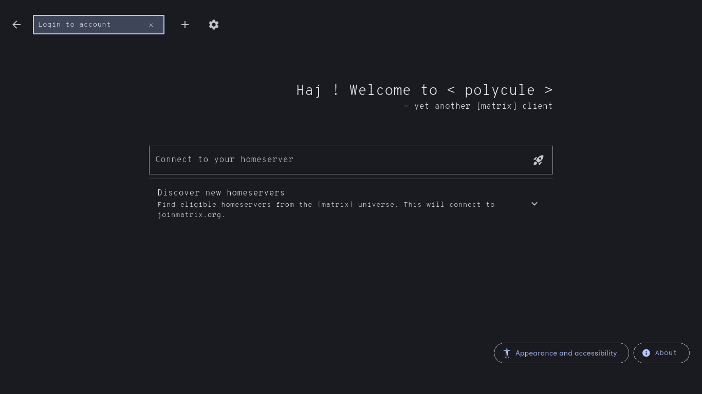
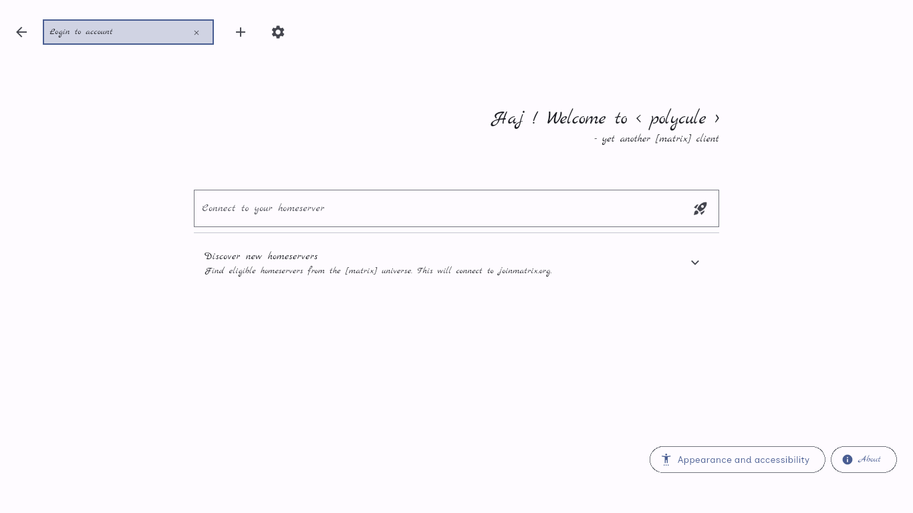
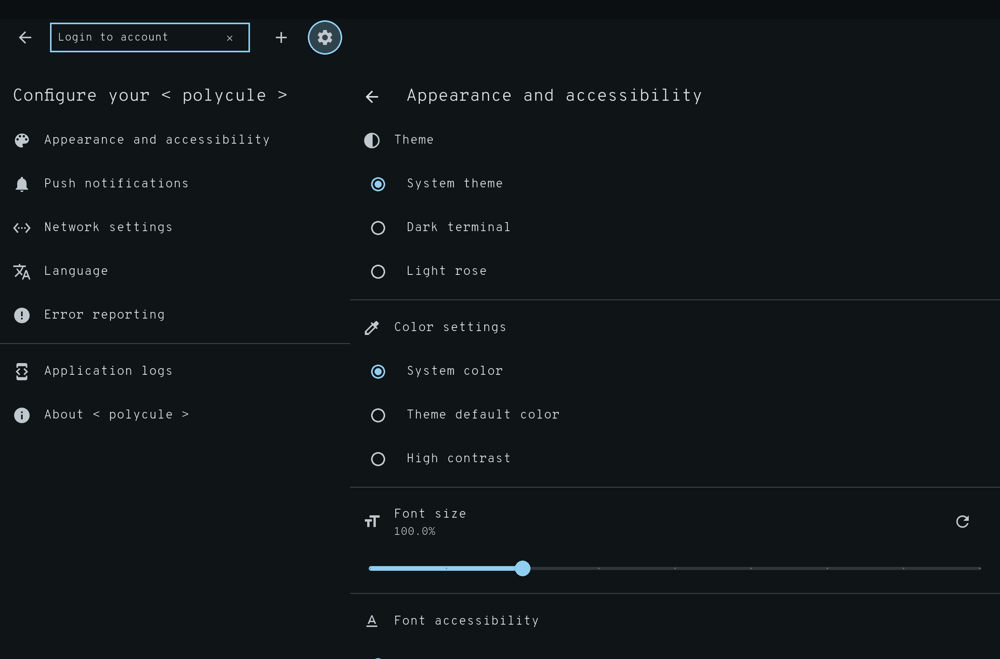

#  < polycule >

![< polycule > - a geeky and efficient \[matrix\] client for power users](assets/artwork/feature-graphic.svg)

**Supports Open ID Connect :white_check_mark: !**

## About

Beep boop and I had too much time during boring work meetings. Using this client as
a small piece to practice some matrix related stuff.

I'm especially considering to experiment
with [Sliding Sync](https://github.com/matrix-org/matrix-spec-proposals/blob/kegan/sync-v3/proposals/3575-sync.md) and
Flutter Linux-native integrations.

## Features

- keyboard optimized
- accessibility focussed development
- no matrix.org !
- fast and efficient
- terminal style design
- cross-platform

See [Roadmap](#Roadmap) for feature parity details.

## Get < polycule >

As a Flutter application < polycule > is available on various platforms as native applications. Some are rather
experimental in support and not production ready. Consult the chart below for means of distribution and platform
specific project status.

| Platform         | Supported architectures              | Source                                                                                                                                                                                                              |       Stable       |
|------------------|--------------------------------------|---------------------------------------------------------------------------------------------------------------------------------------------------------------------------------------------------------------------|:------------------:|
| Alpine Linux     | `AArch64`, `amd64`                   |  | :white_check_mark: |
| Arch Linux       | `AArch64`, `amd64`                   |                                                                        | :white_check_mark: |
| Debian GNU/Linux | `AArch64`, `amd64`                   |              |        :x:         |
| Android          | `arm64-v8a`, `armeabi-v7a`, `x86_64` |                                                | :white_check_mark: |
| iOS              | iPhone, iPad, Apple Silicon Mac      |                                              |        :x:         |
| Web              | Firefox                              |                                                                          |        :x:         |

## Screenshots

|                                                                             |                                                                              |                                                                                        |                                                                                         |
|-----------------------------------------------------------------------------|------------------------------------------------------------------------------|----------------------------------------------------------------------------------------|-----------------------------------------------------------------------------------------|
|                 |                  |                            |                             |
|                 |                  |                            |                             |
|                 |                 |             |  |
|  |  |  |  |

## Thanks

Thanks a lot to my wonderful previous coworkers maintaining
the [Matrix Dart SDK from Famedly](https://github.com/Famedly/matrix-dart-sdk/) and especially Krille, the kind author
of [FluffyChat](https://github.com/krille-chan/fluffychat).

< polycule > does not share any code directly with FluffyChat, both though build upon the same SDK. Some code though
might be quite similar in both clients - they both have a similar code base we know from some enterprise clients.

## Roadmap

| Feature                   |     Supported      |
|---------------------------|:------------------:|
| Homeserver selection      | :white_check_mark: |
| Homeserver proposals      | :white_check_mark: |
| HTTP/3 with QUIC          | :white_check_mark: |
| TLS hardening             | :white_check_mark: |
| Login                     |                    |
| ... native OIDC ready     | :white_check_mark: |
| ... password              | :white_check_mark: |
| ... SSO                   | :white_check_mark: |
| Multi account             |                    |
| ... routing               | :white_check_mark: |
| ... login                 | :white_check_mark: |
| ... incoming URI handling | :white_check_mark: |
| Room list                 | :white_check_mark: |
| Room timeline             | :white_check_mark: |
| Sliding sync              |        :x:         |
| Sending files             | :white_check_mark: |
| HTML renderer             | :white_check_mark: |
| User profiles             | :white_check_mark: |
| Room details              |        :x:         |
| Room settings             |        :x:         |
| Account settings          | :white_check_mark: |
| \[matrix\] widgets        |        :x:         |
| VoIP signaling            |        :x:         |
| Emoji picker              | :white_check_mark: |

## License

Like this project ? [Buy me a Coffee](https://www.buymeacoffee.com/braid).

This piece of software is published under the terms and conditions of the [EUPL-1.2](LICENSE).
