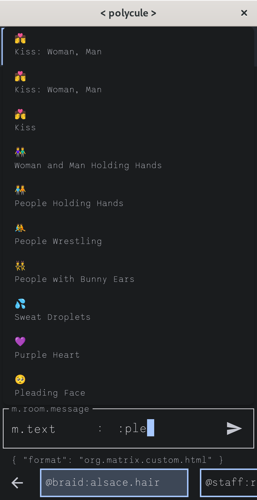
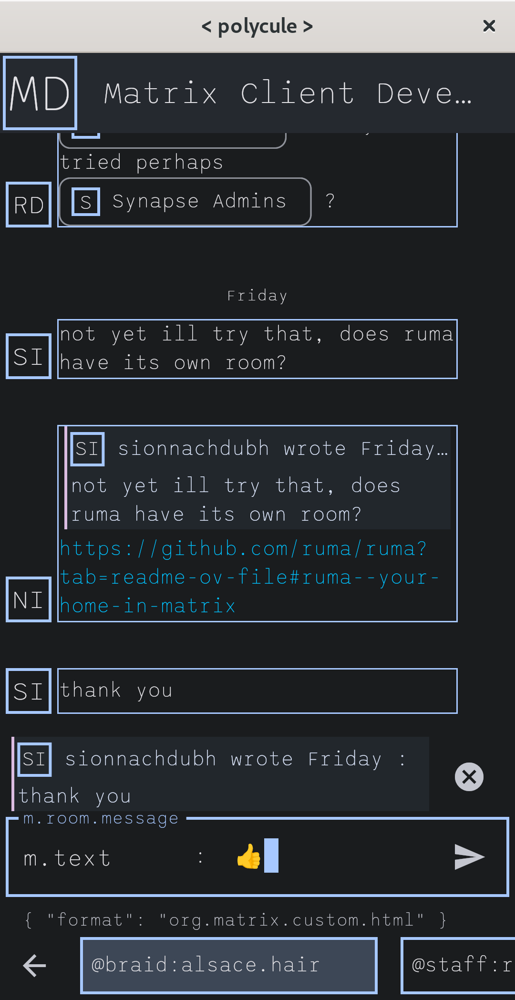
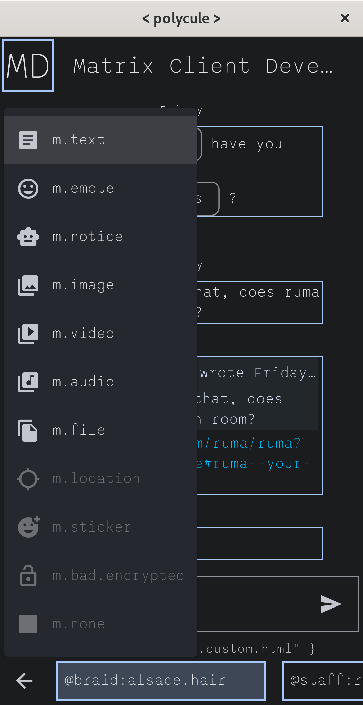

#  < polycule >

A geeky and efficient \[matrix\] client for power users.

**Supports Open ID Connect :white_check_mark: !**

## About

**Is it usable yet ? - Maybe, I dailydrive it.**

See [Roadmap](#Roadmap) for feature details.

Beep boop and I had too much time during boring work meetings. Using this client as
a small piece to practice some matrix related stuff.

I'm especially considering to experiment
with [Sliding Sync](https://github.com/matrix-org/matrix-spec-proposals/blob/kegan/sync-v3/proposals/3575-sync.md) and
Flutter Linux-native integrations.

## Features

- keyboard optimized
- accessibility focussed development
- no matrix.org !
- fast and efficient
- terminal style design
- cross-platform

## Preview

You can try to web-builds hosted on [GitLab pages](https://polycule.im/web/) or download some
Linux and Android builds from the CI jobs.

|                                                              |                                                              |                                                              |                                                              |
|--------------------------------------------------------------|--------------------------------------------------------------|--------------------------------------------------------------|--------------------------------------------------------------|
|  |  |  |  |
|  |  |  |  |
|  |  |                                                              |                                                              |

## Thanks

Thanks a lot to my wonderful previous coworkers maintaining
the [Matrix Dart SDK from Famedly](https://github.com/Famedly/matrix-dart-sdk/) and especially Krille, the kind author
of [FluffyChat](https://github.com/krille-chan/fluffychat).

< polycule > does not share any code directly with FluffyChat, both though build upon the same SDK. Some code though
might be quite similar in both clients - they both have a similar code base we know from some enterprise clients.

## Roadmap

| Feature                   |     Supported      |
|---------------------------|:------------------:|
| Homeserver selection      | :white_check_mark: |
| Homeserver proposals      | :white_check_mark: |
| Login                     |                    |
| ... native OIDC ready     | :white_check_mark: |
| ... password              | :white_check_mark: |
| ... SSO                   |        :x:         |
| Multi account             |                    |
| ... routing               | :white_check_mark: |
| ... login                 | :white_check_mark: |
| ... incoming URI handling | :white_check_mark: |
| Room list                 | :white_check_mark: |
| Room timeline             | :white_check_mark: |
| Sliding sync              |        :x:         |
| Sending files             | :white_check_mark: |
| HTML renderer             | :white_check_mark: |
| User profiles             | :white_check_mark: |
| Room details              |        :x:         |
| Account settings          |        :x:         |
| \[matrix\] widgets        |        :x:         |
| VoIP signaling            |        :x:         |
| Emoji picker              | :white_check_mark: |

*Can you daily drive it ?* - Yes, I do.

## License

Like this project ? [Buy me a Coffee](https://www.buymeacoffee.com/braid).

This piece of software is published under the terms and conditions of the [EUPL-1.2](LICENSE).
